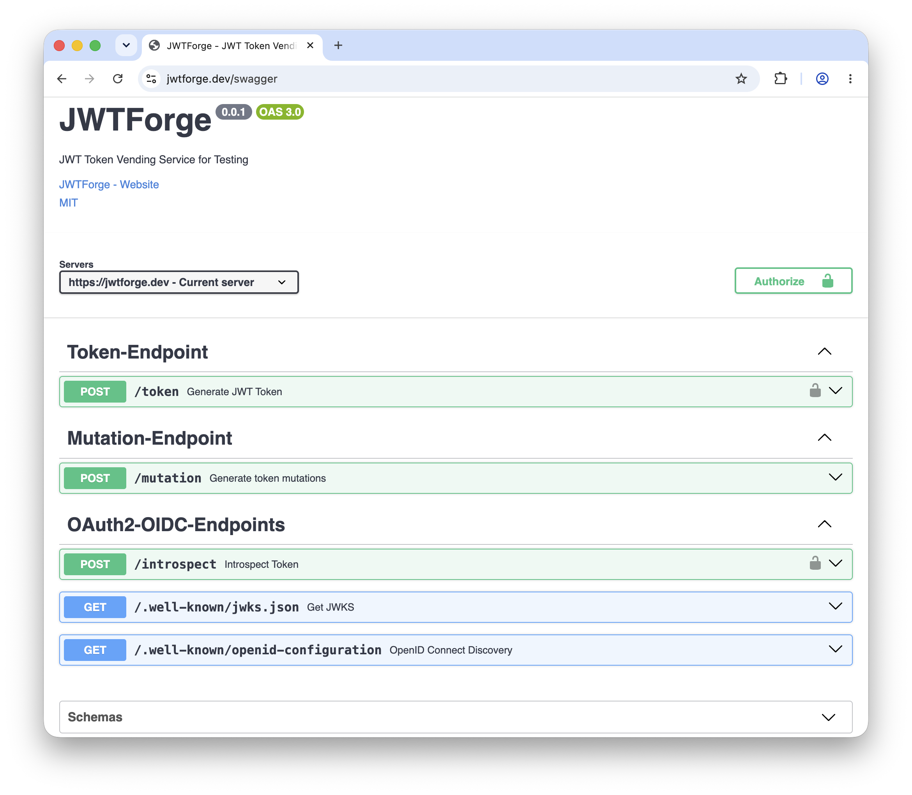

# Summary

JWTForge is an open-source HTTP service that programmatically generates cryptographically signed JSON Web Tokens (JWT) for security testing, fuzzing, and integration testing of OAuth2 and OpenID Connect (OIDC) implementations. It can be run locally or deployed to Cloudflare Workers. JWTForge returns signed tokens transformed by one of four testing modes: *compliant* (Faker-generated realistic OIDC tokens), *fuzz* (Big List of Naughty Strings and boundary values), *malicious* (injection payloads), and *grammar* (categorical RFC-derived patterns). It supports three generation approaches — JSON payload, OAuth2 client_credentials [@rfc6749], and RFC 8693 token exchange [@rfc8693] — and exposes OIDC infrastructure endpoints (RFC 7662 introspection [@rfc7662], JWKS [@rfc7517], discovery [@openid_connect_discovery]). JWTForge also generates compact JWTs, flattened JWS JSON Serialization, and general JWS JSON Serialization for testing parser format-confusion defects. By addressing token *generation* rather than *manipulation*, JWTForge enables reproducible token corpora for CI/CD integration testing, robustness evaluation, and vulnerability research.

# Statement of need

Modern web applications rely extensively on OAuth2 [@rfc6749] and OpenID Connect [@openid_connect] for authentication and authorization. According to the OWASP Top 10 for 2025 [@owasp_top10_2025], broken access control is the leading security risk, with 100% of tested applications exhibiting some form of access control vulnerability. RFC 8725 [@rfc8725] documents systemic JWT implementation weaknesses — algorithm confusion, symmetric key substitution, and missing claim validation — that continue to manifest in production identity systems. Recent public research on JWT implementations has demonstrated sign/encrypt confusion, polyglot-token format confusion, and PBES-derived denial-of-service attacks [@tervoort2023three]. Follow-on library-testing work further shows that parser-level defects, including JWT serialization format confusion, remain relevant across JWT libraries [@yang2026token].

Systematic JWT security testing faces three obstacles. First, using production identity providers (Auth0, Okta, AWS Cognito) for testing risks exposing sensitive data, may violate terms of service, and introduces dependencies that undermine reproducibility. Second, manually constructing JWTs for edge-case testing is labor-intensive and error-prone across the combinatorial space of claims, headers, signatures, and serialization formats. Third, existing tools focus on exploitation of pre-existing tokens rather than systematic generation at scale.

The target audience is broad: security engineers running fuzzing campaigns; penetration testers conducting authorized assessments; researchers studying token validation defects; and developers building OAuth2/OIDC-protected APIs requiring realistic tokens for integration tests. Existing alternatives address only narrow slices of this need — supporting token tampering or brute-force secret recovery but lacking programmable generation, categorical coverage, or OIDC infrastructure. JWTForge fills this gap with a single deployable service combining automated generation, four testing modes, three generation approaches, and OIDC infrastructure for drop-in client library compatibility.

# State of the field

The JWT security tooling ecosystem comprises tools focused on exploitation, interactive editing, brute-force secret recovery, and library-level differential testing. **jwt_tool** [@jwt_tool] performs algorithm confusion attacks, brute-force HMAC recovery, and claim tampering, but requires an existing JWT as input. **JWT Editor** [@jwt_editor] and **JOSEPH** [@joseph] are Burp Suite extensions enabling interactive JWT modification within intercepted traffic; both require proxy-based interception and human interaction, precluding CI/CD integration. **JWT Cracker** [@jwt_cracker] focuses on HMAC-SHA256 secret brute-forcing. **JWTeemo** [@jwteemo], the artifact associated with Token Time Bomb [@yang2026token], targets systematic JWT library testing across signed JWS and encrypted JWE handling and includes format-confusion classes, building on attack categories publicly described by Tervoort [@tervoort2023three]. Its focus is library behavior rather than OAuth2/OIDC application workflows. Cryptographic libraries such as **Nimbus JOSE+JWT** [@nimbus] support programmatic construction but require application-level code to assemble testing scenarios.

JWTForge occupies a distinct position: an HTTP service exposing token-generation and testing modes as API parameters. It complements exploitation tools and library fuzzers by generating reproducible corpora and endpoint-ready test traffic for OAuth2/OIDC applications. Table \ref{tab:comparison} summarises tool capabilities.

\begin{table}[ht]
\centering
\scriptsize
\begin{tabular}{|l|l|l|l|l|l|l|}
\hline
\textbf{Capability} & \textbf{JWTForge} & \textbf{jwt\_tool} & \textbf{JWT Editor} & \textbf{JOSEPH} & \textbf{JWT Cracker} & \textbf{JWTeemo} \\
\hline
Token generation & $\checkmark$ & $\times$ & $\times$ & $\times$ & $\times$ & Limited \\
\hline
JWS testing & $\checkmark$ & $\checkmark$ & $\checkmark$ & $\checkmark$ & Limited & $\checkmark$ \\
\hline
JWE testing & $\times$ & Limited & $\checkmark$ & Partial & $\times$ & $\checkmark$ \\
\hline
Compression DoS testing & $\times$ & Limited & Manual & $\times$ & $\times$ & $\checkmark$ \\
\hline
Billion Hashes attack testing & $\times$ & $\times$ & Manual & $\times$ & $\times$ & $\checkmark$ \\
\hline
Automated fuzzing & $\checkmark$ & Limited & $\times$ & $\times$ & $\times$ & $\checkmark$ \\
\hline
Injection payloads & $\checkmark$ & $\times$ & $\times$ & $\times$ & $\times$ & Partial \\
\hline
Algorithm confusion & $\checkmark$ & $\checkmark$ & Partial & Partial & $\times$ & $\checkmark$ \\
\hline
Format confusion & $\checkmark$ & $\times$ & Partial & $\times$ & $\times$ & $\checkmark$ \\
\hline
OIDC infrastructure & $\checkmark$ & $\times$ & $\times$ & $\times$ & $\times$ & $\times$ \\
\hline
CI/CD integration & $\checkmark$ & Limited & $\times$ & $\times$ & $\checkmark$ & Limited \\
\hline
Signature tampering & Partial & $\checkmark$ & $\checkmark$ & $\checkmark$ & $\times$ & $\checkmark$ \\
\hline
Brute-force cracking & $\times$ & $\checkmark$ & $\times$ & $\times$ & $\checkmark$ & $\times$ \\
\hline
Serverless deployment & $\checkmark$ & $\times$ & $\times$ & $\times$ & $\times$ & $\times$ \\
\hline
\end{tabular}
\vspace{0.5cm}
\caption{Comparative capabilities of JWT security tools. JWTForge occupies a distinct position within the JWT security ecosystem, addressing token \textit{generation} rather than token \textit{manipulation}. Checkmarks ($\checkmark$) indicate full support, crosses ($\times$) indicate no support, and ``Partial'' or ``Limited'' indicate restricted or partial functionality.}
\label{tab:comparison}
\end{table}

# Software design

JWTForge is a JavaScript HTTP API for token generation and OIDC infrastructure, installable via `npm` or deployable to Cloudflare Workers. Its modules separate request parsing, claim transformation, key management, and response formatting.

## Token Generation Workflow

Token generation proceeds through five stages.

1. **Request Parsing:** The HTTP request body is parsed to extract JWT claims, metadata fields (`kty`, `mode`, `response_type`, `exclude`, `header_alg`, `header_kid`, `format`), custom claims, and optional structured fields (`header`, `body`, `signature`, `signatures`).

2. **OIDC Scope Processing:** In compliant mode, standard scopes (`openid`, `profile`, `email`, `address`, `phone`) populate corresponding Faker-backed claims [@faker; @openid_connect].

3. **Mode-Specific Transformations:** `fake`, `fuzz`, `malicious`, and `grammar` modes generate realistic claims, BLNS/boundary values, injection payloads, or RFC-derived categorical values.

4. **Header and Format Processing:** Header transforms cover `alg` confusion and `kid` injection patterns. The `format` parameter selects compact JWT or JWS JSON Serialization for format-confusion tests.

5. **Signing and Response:** Modified claims are assembled with the JWT header and signed using the Web Crypto API [@w3c_webcrypto]. Compact JWT output is the default, while callers can request flattened JWS JSON Serialization or general JWS JSON Serialization via the `format` parameter. For hybrid flows (`response_type=id_token token`), access and ID tokens are generated independently.

{width=100%}

## Token Generation Approaches

JWTForge supports three operationally distinct generation approaches:

1. **Direct JSON Payload:** Clients submit claims as a JSON object, providing maximum flexibility for unit testing, integration testing, and adversarial payload injection. Custom claims, OIDC scopes, and modes are all supported.

2. **OAuth2 Client Credentials Grant (RFC 6749):** Clients authenticate via HTTP Basic auth and request tokens with `grant_type=client_credentials` and optional `scope`/`sub` parameters. Base claims are auto-generated, enabling testing of OAuth2-compliant endpoints and client authentication mechanisms.

3. **Token Exchange (RFC 8693):** Clients submit a subject token (JWT, ID token, or access token) with optional `add_claims`/`remove_claims` modifications, enabling testing of exchange scenarios, delegation flows, and claim transformation without access to the original issuer. The introspection endpoint validates exchanged tokens, completing the lifecycle.

Across these approaches, JWTForge can produce either compact JWTs or JWS JSON Serialization outputs. The latter enables format-confusion testing: a vulnerable JWT implementation misidentifies the JWT serialization format, allowing an attacker to transform an otherwise legitimate compact-format JWT into a JSON-format JWS, insert forged payload material, and potentially achieve arbitrary token forgery. This corresponds to the polyglot-token class in prior JWT research [@tervoort2023three].

## Workflow Scenarios

JWTForge supports two operational patterns (Figure \ref{fig:cicd}, Figure \ref{fig:researcher}). In CI/CD, a commit triggers local API and JWTForge deployment; Postman/Newman runs compliant, fuzz, malicious, and format-confusion tests, gating promotion to beta, gamma, and production. In security research, JWTForge generates adversarial tokens across all four modes and multiple JOSE serializations to probe algorithm confusion, format confusion, injection, and authorization bypass; researchers analyze target-API responses to produce reproducible, responsibly disclosed findings.

{width=100%}

{width=100%}

# Research impact

JWTForge enables several lines of research on authentication, authorization, and microservice observability that currently lack a programmable token generation infrastructure.

**Observability research in microservice architectures.** Empirical studies of microservices — collection of logs, metrics, and traces under authentication load — require reproducible token streams without the confounders of production identity providers [@bakhtin2025lo2; @nugraha2023performance]. JWTForge provides deterministic generation at sustained throughput (586 requests/second, 12 ms mean latency, zero error rate across 74,315 requests on a Mac M2 Pro), enabling controlled studies of authentication overhead and trace propagation across OAuth2-protected service meshes.

**Security evaluation and vulnerability discovery.** Researchers studying JWT performance and validation defects often construct ad hoc corpora [@rahmatulloh2019performance; @yang2026token; @nugraha2023performance]. JWTForge supplies reproducible realistic, stochastic, adversarial, and categorical token sets. Its malicious mode, grammar mode, and header transformations operationalise key confusion [@xu2023jwtkey], injection, format-confusion, and claim-handling tests as API parameters.

**Black-box measurement studies.** Large-scale automated measurement of authentication implementations [@costa2026automated] requires combining token mutation with original request context replay. JWTForge's RFC 8693 token exchange [@rfc8693] supports this directly: a captured token can be exchanged into a mutated variant while preserving the surrounding request context.

# Availability

JWTForge is freely available from [GitHub](https://github.com/abhishektiwari/jwtforge) under the MIT license, with interactive OpenAPI documentation. The software can be installed locally via via `npm install -g abhishektiwari/jwtforge` for CLI use or CI/CD automation, or deployed with one click to Cloudflare Workers for self-hosted access. A public hosted instance is available at [https://jwtforge.dev](https://jwtforge.dev) for immediate browser-based token generation and testing without installation.

# AI usage disclosure

AI tools were used for developing JWTForge. AI tools were also used to assist with editing portions of this manuscript. All AI-assisted code outputs were reviewed, validated, and tested by the human author, who takes full responsibility for the final software and paper. No figures or data were generated by AI.

# References
